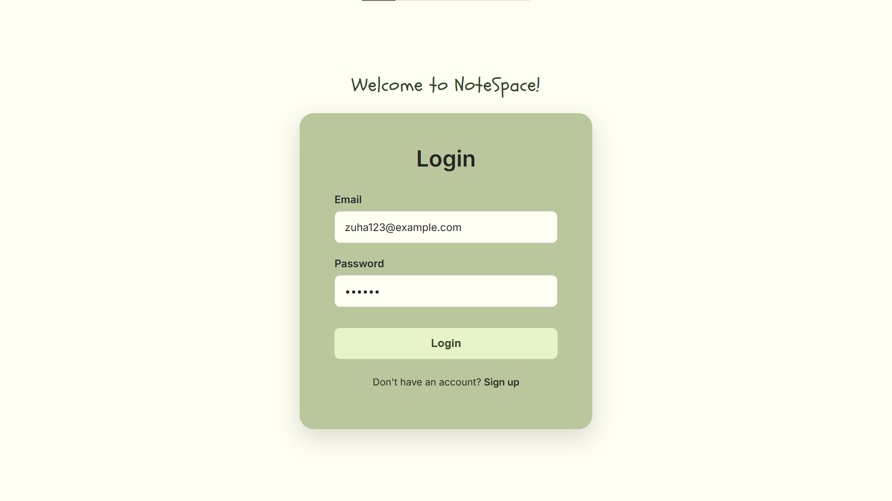
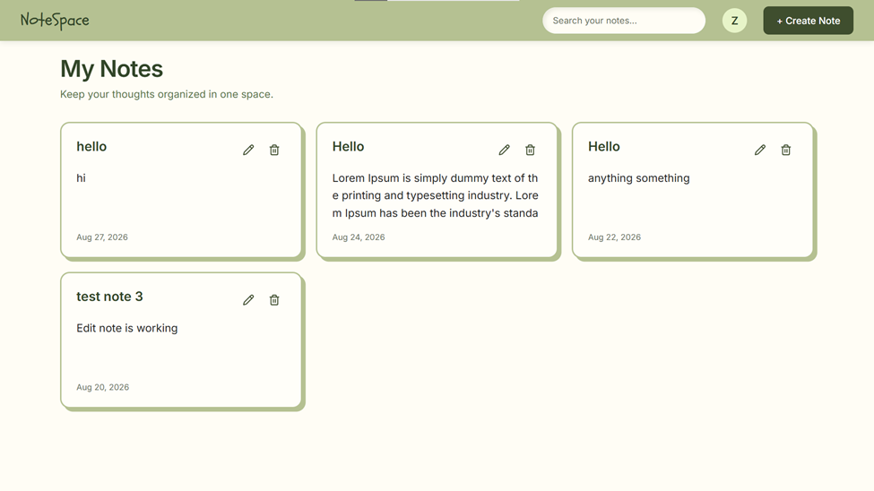
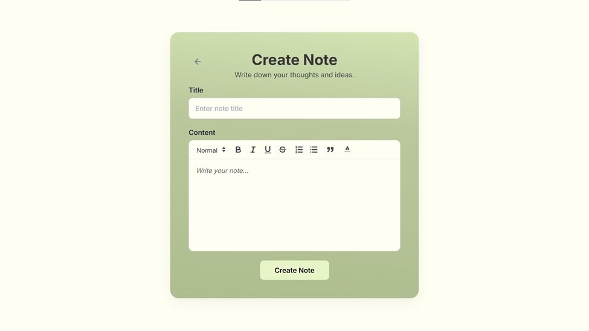
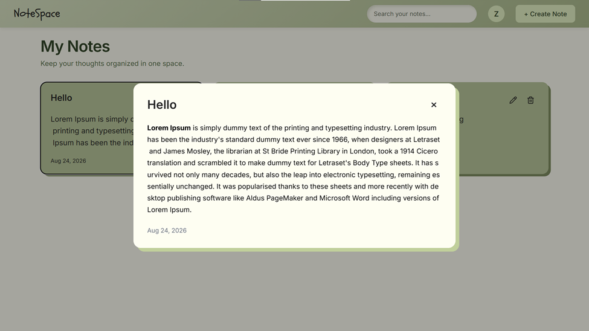
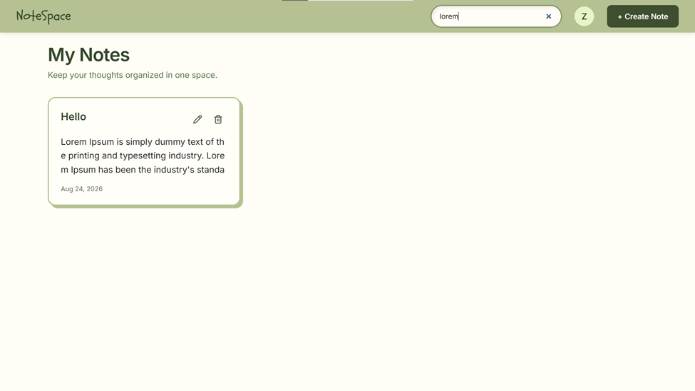
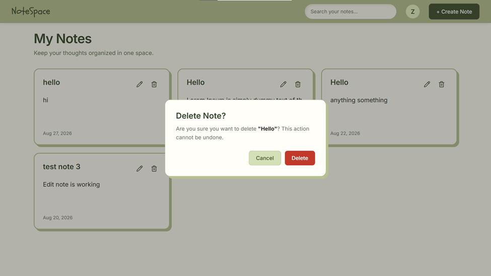

# NoteSpace

NoteSpace is a MERN-style notes application: a React frontend and an Express API backed by MySQL. Users register, sign in with an HTTP-only JWT cookie, and create, search, edit, and delete their own notes. Rich text is edited with Quill (`react-quill-new`).

This repository is the Cohort 9 MERN assignment for Zuha Wahab.

---

## Table of Contents

- [Features](#features)
- [Technology Stack](#technology-stack)
- [Project Structure](#project-structure)
- [Setup and Installation](#setup-and-installation)
- [Environment Variables](#environment-variables)
- [Running the App](#running-the-app)
- [API Reference](#api-reference)
- [Authentication](#authentication)
- [Testing](#testing)
- [Linting](#linting)
- [SonarQube Setup](#sonarqube-setup-and-analysis)
- [Screenshots](#screenshots)

---

## Features

- User registration (name, email, password) and login
- Session-based authentication via an HTTP-only `token` cookie (JWT, 1-hour expiry)
- Session restore with `GET /api/auth/me` and protected client routes
- Logout that clears the auth cookie
- Create, list, view, update, and delete notes (scoped to the authenticated user)
- Rich-text note content (headings, bold/italic/underline/strike, lists, blockquote, color, alignment)
- Dashboard search across note titles and plain-text content
- Profile menu with user name/email and logout
- Delete confirmation on note cards
- Request logging (Pino) with redaction of email, password, tokens, and cookies
- CORS with credentials, using `FRONTEND_URL` (required in production)

## Technology Stack

**Frontend**
- React 19, React Router 7, Vite 8
- Axios
- `react-quill-new`
- `lucide-react`
- Jest, Testing Library, ESLint

**Backend**
- Node.js, Express 5
- MySQL (`mysql2` connection pool)
- JWT (`jsonwebtoken`), bcrypt, cookie-parser, CORS, dotenv
- Pino / pino-http
- Mocha, Chai, Supertest, Sinon, Nodemon

## Project Structure

```text
.
├── backend/
│   ├── app.js                 # Express app, CORS, routes
│   ├── server.js              # DB connect and listen
│   ├── .env.example
│   ├── config/db.js
│   ├── controllers/
│   ├── middleware/            # auth, validation, errors, HTTP logging
│   ├── models/
│   ├── routes/                # /api/auth, /api/notes
│   ├── services/
│   ├── logger/
│   └── tests/
├── frontend/
│   ├── src/
│   │   ├── pages/              # Login, Signup, Dashboard, CreateNote, EditNote
│   │   ├── components/         # NoteCard, NoteList, NoteForm, RichTextEditor, ProtectedRoute
│   │   ├── context/             # AuthProvider
│   │   └── services/            # auth and notes API clients
│   ├── eslint.config.js
│   └── jest.config.cjs
└── README.md
```

> **Note:** There is no workspace-level `package.json`. The frontend and backend are installed and run separately.

## Setup and Installation

### Requirements
- Node.js and npm
- MySQL

### Clone and Install

```bash
git clone <repository-url>
cd cohort-9-mern-16436-zuha

cd backend
npm install

cd ../frontend
npm install
```

### Database

The API expects a MySQL database named in `DB_NAME` with at least the following tables:

| Table | Columns |
|---|---|
| `users` | `id`, `name`, `email`, `password` |
| `notes` | `id`, `title`, `content`, `user_id`, `created_at` |

> **Note:** There is no SQL schema/migration file in this repository. Create equivalent tables manually before starting the backend.

## Environment Variables

### Backend (`backend/.env`)

| Variable | Purpose |
|---|---|
| `PORT` | HTTP port (defaults to `5000` if unset) |
| `DB_HOST` | MySQL host |
| `DB_PORT` | MySQL port |
| `DB_USER` | MySQL user |
| `DB_PASSWORD` | MySQL password |
| `DB_NAME` | Database name |
| `JWT_SECRET` | Secret used to sign and verify JWTs |
| `FRONTEND_URL` | Allowed CORS origin. Defaults to `http://localhost:5173` if unset. **Required when `NODE_ENV=production`.** |
| `NODE_ENV` | Used for the production CORS check and the `Secure` cookie flag (`production` only) |

`backend/.env.example`:

```env
PORT=5000
DB_HOST=localhost
DB_PORT=3306
DB_USER=your_username
DB_PASSWORD=your_password
DB_NAME=your_database
JWT_SECRET=your_jwt_secret
FRONTEND_URL=http://localhost:5173
```

Copy it to `backend/.env` and replace the placeholders. Do not commit `.env` (already ignored via `backend/.gitignore`).

### Frontend

`frontend/src/services/noteService.js` reads `import.meta.env.VITE_API_URL` and calls `{VITE_API_URL}/api/notes`.

> **Note:** Auth requests in `frontend/src/services/authService.js` are currently hardcoded to `http://localhost:5000/api/auth` and do not use `VITE_API_URL`.

There is no `frontend/.env.example` in the repository. Vite will pick up `VITE_*` variables from a local env file (e.g., `.env`). Typical local value:

```env
VITE_API_URL=http://localhost:5000
```

## Running the App

### Frontend

From `frontend/`:

```bash
npm run dev
```

Vite serves the app at `http://localhost:5173` by default.

Other available scripts:

```bash
npm run build      # production build
npm run preview    # preview the production build
```

> Start the backend first so login and notes API calls succeed.

### Backend

From `backend/`, with `.env` configured and MySQL running:

```bash
npm run dev        # nodemon server.js
```

or:

```bash
npm start          # node server.js
```

The server listens on `PORT` (default **5000**). `GET /` responds with `Backend is running`. The process exits on startup if the database connection fails.

## API Reference

**Base URL:** `http://localhost:5000` (or your configured `PORT`)
All requests/responses use JSON. The `token` cookie is sent with `credentials: true`.

### Auth — `/api/auth`

| Method | Path | Auth Required | Description |
|---|---|---|---|
| `POST` | `/api/auth/register` | No | Register. Body: `{ name, email, password }`. Returns **201** with `{ success, message, data: null }`. |
| `POST` | `/api/auth/login` | No | Login. Body: `{ email, password }`. Sets the `token` cookie. Returns **200**. |
| `POST` | `/api/auth/logout` | No | Clears the `token` cookie. Returns **200**. |
| `GET` | `/api/auth/me` | Cookie | Returns the current user: `{ id, name, email }`. |
| `GET` | `/api/auth/protected` | Cookie | Smoke test for a valid session. |

**Registration validation:** all fields required and must be strings; `name` non-empty after trimming; valid email format; password at least 6 characters. Duplicate email returns **400** (`Email already exists`).

**Login validation:** email and password required; valid email format. Invalid credentials return **401**.

### Notes — `/api/notes`

All note routes require a valid `token` cookie.

| Method | Path | Description |
|---|---|---|
| `POST` | `/api/notes` | Create a note. Body: `{ title, content }`. Returns **201**. |
| `GET` | `/api/notes` | List notes for the current user, ordered by `created_at` descending. |
| `GET` | `/api/notes/:id` | Retrieve a note if it belongs to the current user. Returns **404** otherwise. |
| `PUT` | `/api/notes/:id` | Update a note's title/content. Returns **404** if missing or not owned. |
| `DELETE` | `/api/notes/:id` | Delete a note. Returns **404** if missing or not owned. |

**Validation:** `title` and `content` are required, non-whitespace strings on create. `:id` must be a positive integer.

Unauthorized or missing/invalid JWTs return **401** (`Authentication required` or `Invalid or expired token`).

**Error format:** `{ success: false, message, data: null }`. Any status `>= 500` returns a generic `Internal Server Error` message (no internal details are leaked).

## Authentication

1. **Register** stores a bcrypt-hashed password (cost factor 10). It does not log the user in automatically.
2. **Login** verifies the password and signs a JWT (`{ id }`) using `JWT_SECRET`, with `expiresIn: "1h"`.
3. The token is set as an HTTP-only cookie named `token`: `httpOnly`, `sameSite: "lax"`, 1-hour `maxAge`, and `secure` only when `NODE_ENV === "production"`.
4. Protected API routes read `req.cookies.token` and verify it against `JWT_SECRET`.
5. The React `AuthProvider` calls `GET /api/auth/me` on load; `ProtectedRoute` redirects unauthenticated users to `/login`.

**Client Routes**

| Path | Access |
|---|---|
| `/`, `/login` | Login |
| `/signup` | Signup |
| `/dashboard` | Protected |
| `/notes/new` | Protected |
| `/notes/:id/edit` | Protected |

## Testing

### Backend

Requires MySQL and a configured `.env`. Some tests create real users/notes.

```bash
cd backend
npm test
```

Runs Mocha against `tests/**/*.test.js`, covering auth/notes HTTP endpoints, auth/note services, and auth/validation/error middleware.

### Frontend

```bash
cd frontend
npm test
```

Runs Jest (`jsdom` environment) for pages, components, and the auth context.

Optional coverage (not a named npm script, but supported by Jest):

```bash
cd frontend
npx jest --coverage
```

Coverage reports are output to `frontend/coverage/` (including `lcov.info`). The backend does not currently have a coverage script.

## Linting

Linting is configured for the frontend only.

```bash
cd frontend
npm run lint
```

Configuration: `eslint.config.js`. The `dist` and `coverage` directories are ignored. There is no backend ESLint configuration or lint script.

## SonarQube Setup and Analysis

> **Note:** There is no `sonar-project.properties` file in this repository. A local scan has previously been recorded under `.scannerwork/` against the configuration below.

- **Host:** `http://localhost:9000`
- **Project key:** `cohort-9-mern-16436-zuha`
- **SonarQube server version (from last scan metadata):** `26.8.0.126808`

### Typical Local Flow

1. Run SonarQube and open `http://localhost:9000`.
2. Create a project (or reuse key `cohort-9-mern-16436-zuha`) and generate a user token.
3. Optionally generate coverage (frontend: `npx jest --coverage` → `frontend/coverage/lcov.info`). Existing `backend/coverage/lcov.info` / `frontend/coverage/lcov.info` files can be reused if present.
4. From the repository root, run the scanner:

```bash
sonar-scanner \
  -Dsonar.projectKey=cohort-9-mern-16436-zuha \
  -Dsonar.host.url=http://localhost:9000 \
  -Dsonar.token=<your-token>
```

5. View the dashboard at: `http://localhost:9000/dashboard?id=cohort-9-mern-16436-zuha`

> **Do not commit tokens or the `.scannerwork/` directory.**

## Screenshots
### Login


### Dashboard


### Create Note


### View Note


### Search Note


### Delete Note



---

## Known Gaps / Notes for Maintainers

- No root-level `package.json` — install frontend and backend dependencies separately.
- No backend lint script or ESLint configuration.
- No SQL migration/schema file — database tables must be created manually.
- The auth service's API base URL is hardcoded rather than driven by `VITE_API_URL`.
- `userModel.deleteUserByEmail` is referenced in a test file but not currently exported from `userModel.js`.
